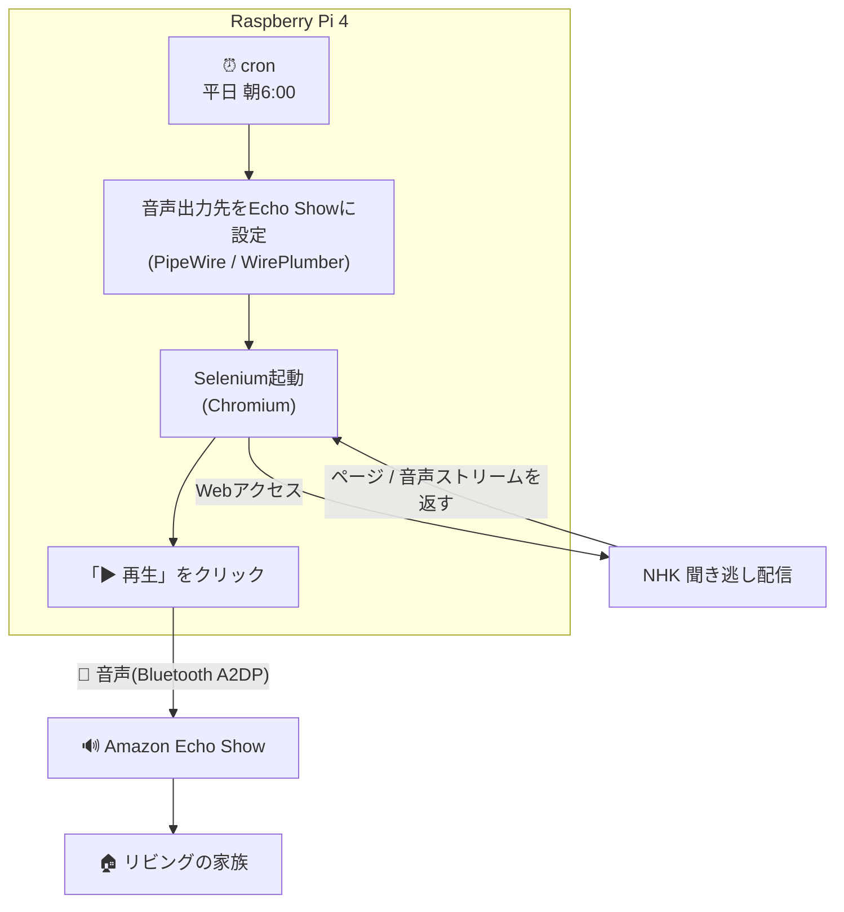

# NHK「ラジオビジネス英語」自動再生(Amazon Echo)

NHK「ラジオビジネス英語」の聞き逃し配信を、毎朝6時に自動再生するRaspberry Pi用スクリプト集です。Seleniumでブラウザ操作を自動化し、Bluetooth(A2DP)経由でAmazon Echoから音声を流します。

開発の経緯・技術選定・トラブルシューティングの詳細は、こちらのQiita記事にまとめています。

👉 [朝6時に英会話ラジオのアーカイブ(爆音)で、家族を起こす](https://qiita.com/okann/items/8150dca24bff3fb91763)

## 構成



## 必要なもの

- Raspberry Pi 4(2GB以上を推奨)
- Amazon Echo(Bluetooth A2DP対応)
- Raspberry Pi OS Bookworm(PipeWire/WirePlumber標準搭載)

## セットアップ

### 1. 必要パッケージのインストール

```bash
sudo apt install -y chromium-chromedriver
pip install selenium --break-system-packages
sudo apt install -y bluez
sudo apt install -y xvfb
```

### 2. Echoとのペアリング

Echo側で「アレクサ、ペアリングして」と話しかけて待受状態にする。

GUIの場合:画面右上のBluetoothアイコンから、表示されたEchoを選択する。

CLIの場合(SSH運用など):

```bash
bluetoothctl
power on
agent on
default-agent
scan on
# Echoが一覧に表示されたら scan off し、MACアドレスを使って:
pair XX:XX:XX:XX:XX:XX
trust XX:XX:XX:XX:XX:XX
connect XX:XX:XX:XX:XX:XX
exit
```

### 3. 環境変数の設定

```bash
cp .env.example .env
nano .env  # ECHO_SINK_NAME, PI_USER を実際の値に置き換える
```

`ECHO_SINK_NAME`は`pactl list sinks short`で確認できます。

### 4. cronへの登録

```bash
crontab -e
```

```
0 6 * * 1-5 /path/to/run_nhk_echo.sh >> /path/to/nhk_cron.log 2>&1
```

## ファイル構成

| ファイル | 内容 |
|---|---|
| `nhk_radio_echo.py` | Echo出力用の本体スクリプト(Selenium再生) |
| `nhk_radio_wired.py` | 有線スピーカー出力用の本体スクリプト(未運用) |
| `run_nhk_echo.sh` | cronから呼ばれるラッパースクリプト(音声出力先設定・音量設定・Selenium実行) |
| `wireplumber-bluetooth-config.lua` | Echoが「Audio Gateway」に固定される問題を解消する設定ファイル |
| `.env.example` | 環境変数(Sink名・ユーザー名等)のテンプレート |
| `.gitignore` | `.env`・ログ等、公開しない対象の除外設定 |
| `version-before-upgrade.txt` | OSS Issue対応時に確認した、アップグレード前のパッケージバージョン記録 |

## 既知の制限

- 子供の枕元用の有線出力ルートは未実装
- Wayland環境下でXvfbが実モニターへの描画を防げない問題が未解決
- Bluetooth接続の長期安定性は継続観察中

詳細は [Qiita記事](https://qiita.com/okann/items/d8d304f31fe321424bf6) を参照してください。

## Related

- [WirePlumber Issue #978](https://gitlab.freedesktop.org/pipewire/wireplumber/-/work_items/978) — Echo本体の物理音量ボタンによる接続不安定の報告

## License

MIT License([LICENSE](./LICENSE)を参照)

本コードは自宅の私的利用を前提に作成したものです。ご自身の環境で試す場合は自己責任でお願いします(Bluetooth接続やcron設定の失敗により、機器が意図しない動作をする可能性があります)。
